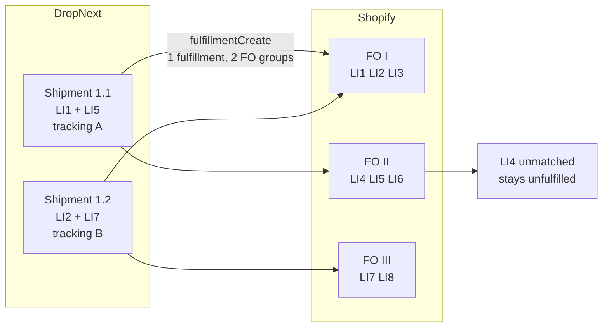

# Fulfillment verification (DSS)

> **Temporary note.** This document describes the sync as it runs since 2026-08-31: additive, never cancelling,
> matched against live remaining quantity. Three gaps are known (see "Known gaps"). The planned design is in
> `specs/shipment-sync-by-tracking-number/`: `000-analysis-cancel-and-recreate.md` explains why the cancel went and
> what that broke, `010-skip-shipments-already-fulfilled.md` makes a re-sent payload safe,
> `020-cancel-replaced-fulfillments.md` cancels exactly the fulfillments whose tracking numbers the monolith names as
> replaced (the supplier portal's shipment split), `030-report-per-shipment-outcomes.md` changes the response, and
> `040-rewrite-the-fulfillment-docs.md` rewrites this document to the landed design and removes this note.

Checklist for verifying **supplier shipment → Shopify fulfillment** via the monolith → DSS path. DSS does not call the Supplier API directly; the monolith bridges supplier events to DSS webhooks defined in the contract spec, [`src/resources/monolith-dss-openapi.json`](../src/resources/monolith-dss-openapi.json).

## Glossary

| Term | Meaning |
|------|---------|
| **Supplier order** | A monolith-side order sent to a supplier for fulfillment. It may split into several DropNext shipments over time. |
| **Shipment** | A physical package with one tracking number and a set of `(product_variant_id, quantity)` lines, sent in `SyncShipmentsWithFulfillmentsRequest.shipments[]`. |
| **Line item** | A row on the Shopify order or on a fulfillment order, identified in this flow by `product_variant_id` (the Shopify variant's `legacyResourceId`). |
| **Fulfillment order** | Shopify's unit of fulfillment work; an order can have several (for example one per location). Only an `OPEN` or `IN_PROGRESS` fulfillment order accepts a new fulfillment; Shopify closes one when it is completed. |
| **Fulfillment** | A Shopify fulfillment with tracking info, created with `fulfillmentCreate`: one per DropNext shipment that matched at least one line. |
| **Fulfillment-order line item** | A line of a fulfillment order. `remainingQuantity` is live (already reduced by existing fulfillments) and is what matching consumes; `totalQuantity` is loaded but not used for matching. |

DropNext shipments and Shopify fulfillment orders are independent groupings. A shipment whose lines sit on two
fulfillment orders becomes one Shopify fulfillment whose line items are grouped by fulfillment order, not one
fulfillment per fulfillment order. A line of the order that no shipment names stays unfulfilled:



## Prerequisites

- Shopify app scopes include `write_merchant_managed_fulfillment_orders` and `read_merchant_managed_fulfillment_orders`.
- Monolith and DSS share `DSS_API_KEY`: the monolith sends it as `Authorization: Bearer <DSS_API_KEY>` on `POST /sync-shipments-with-fulfillments`, `POST /tracking-update`, and `PUT /stores/api-key`; the matching auth guard is the `authenticate(MONOLITH_WEBHOOK_AUTH)` route block.
- Shopify Admin token resolvable for the shop — seed `DSS_SHOP_ACCESS_TOKENS`, complete OAuth, or have the monolith persist one via `PUT /stores/api-key` (a miss falls back to `MonolithService.getStore`).
- `MONOLITH_BASE_URL` set on DSS for order/product webhooks (Shopify → monolith).

## Path reference

| Monolith intent | DSS URL | Request body |
|-----------------|---------|--------------|
| Supplier created a shipment | `POST /sync-shipments-with-fulfillments` | `SyncShipmentsWithFulfillmentsRequest` |
| Carrier tracking status (e.g. AfterShip) | `POST /tracking-update` | `TrackingUpdateRequest` |

## Step A — Order ingest (Shopify → monolith)

1. Place a test order on the staging shop (variant-backed line items).
2. Confirm DSS logs: webhook verified → `Monolith create order accepted`.
3. Confirm monolith order has correct `product_variant_id` and **non-zero** `fulfillment_order_id` on each line.

## Step B — Supplier shipment → Shopify fulfill

1. Create a supplier shipment in the monolith for that order.
2. Monolith POSTs to `{DSS_URL}/sync-shipments-with-fulfillments` with a body like:

```json
{
  "shopify_subdomain": "acme-downtown",
  "shopify_order_id": 1001,
  "shipments": [{
    "tracking_number": "1Z999AA10123456784",
    "carrier": "UPS",
    "tracking_url": "https://www.ups.com/track?tracknum=1Z999AA10123456784",
    "line_items": [{ "product_variant_id": 101, "quantity": 1 }]
  }]
}
```

3. Expect **HTTP 200** and a JSON body with `new_fulfillment_ids` (array of Shopify fulfillment legacy IDs created during this sync):

```json
{
  "new_fulfillment_ids": [5001]
}
```

- One entry per shipment that had at least one matchable line item (one `fulfillmentCreate` per such shipment).
- Empty array when every line in every shipment was skipped (see partial match below) — still **200**.
4. In Shopify Admin: order shows fulfillment with tracking; matched line items marked fulfilled.

### Sync phases

The sync is additive: it never cancels or changes an existing fulfillment.

```
validate the request
  → load the order (GetOrderForDss)
  → match every shipment against the live remaining quantity of the open fulfillment-order lines,
    with one quantity ledger across the whole payload
  → any quantity error: 400, nothing created
  → one fulfillmentCreate per shipment with at least one matched line, in payload order,
    stopping at the first failure
```

Matching rules:

- Duplicate `product_variant_id` rows within one shipment are summed first.
- A line matches an open fulfillment-order line of the same variant. When several carry it, the one with the most
  left in the ledger wins, the first in Graphql order on a tie.
- A variant on no open fulfillment order is skipped (`no_open_fo`); a variant whose open lines have nothing
  remaining is skipped (`zero_remaining`).
- A quantity above what is left, on the line or in the ledger after earlier shipments of the same payload, is an
  error for the whole payload.

### Partial match (unmatched variants)

When a shipment line's `product_variant_id` does not appear on any open fulfillment order line, DSS **skips that line** and continues — it does not fail the whole sync.

| Situation | HTTP | Shopify effect |
|-----------|------|----------------|
| Line matches an open fulfillment-order line with enough remaining | 200 | Included in `fulfillmentCreate` |
| Variant not on any open fulfillment order | 200 | Line skipped; matched lines still fulfilled |
| All lines in a shipment unmatched | 200 | No create for that shipment; `new_fulfillment_ids` omits it |
| Quantity exceeds `remainingQuantity` (single line or cross-shipment total) | **400** | Nothing created; existing fulfillments untouched |
| Order not found | **404** | No mutations |

**Partial-match manual check:**

1. Send a shipment with one known-good variant and one bogus `product_variant_id` (e.g. `999`).
2. Expect **HTTP 200** with `new_fulfillment_ids` containing one ID.
3. In Shopify Admin: the good variant is fulfilled; the bogus variant stays unfulfilled.
4. In DSS logs at `warn`: `sync-shipments skipped line … variant=999 reason=no_open_fo`.

**Hard-failure manual check:**

1. Note existing fulfillments on a test order.
2. POST a payload where a line quantity exceeds the fulfillment-order line's `remainingQuantity`.
3. Expect **400**; confirm no fulfillment was added and the existing ones are unchanged in Shopify Admin.

**Failure checks (request validation and sync):**

- Malformed body, missing fields, non-positive `shopify_order_id`, invalid `shopify_subdomain`, duplicate `tracking_number` within one payload → **400**.
- Quantity greater than `remainingQuantity` (including cross-shipment over-allocation) → **400**, nothing created.
- Order not found in Shopify → **404**.
- No resolvable Shopify Admin token for the shop, or a token Shopify rejects → **401**.
- Shopify unreachable, throttling, or answering a `5xx` → **502**.
- Shopify refuses a create (a user error) → **400**.
- A failure after some creates → the fulfillments created before it stay in Shopify, and the error body does not name them (known gap 3).

## Step C — Tracking event (AfterShip-style)

1. Monolith POSTs to `{DSS_URL}/tracking-update` with the **same** `tracking_number` as step B:

```json
{
  "shopify_subdomain": "acme-downtown",
  "shopify_order_id": 1001,
  "tracking_number": "1Z999AA10123456784",
  "status": "in_transit",
  "happened_at": "2026-04-02T08:30:00Z"
}
```

2. Expect **HTTP 200** and `fulfillment_event_id`.
3. Shopify fulfillment timeline shows the event (e.g. in transit).
4. A tracking number on none of the order's fulfillments → **404**; an unsupported `status` → **400**.

## Operational notes

- DSS logs a summary at `info` after each successful sync, e.g. `sync-shipments orderId=1001 shop=acme canceled=0 created=1 skippedShipments=0 fulfillmentIds=[5001]`. `canceled` is always `0`: the cancel operation still exists in the code, but nothing plans one.
- Per skipped line at `warn`: `sync-shipments skipped line … tracking=… variant=… reason=no_open_fo qty=…`; per shipment with no matched line: `sync-shipments skipped shipment … tracking=… reason=all_lines_unmatched`.
- Shopify webhooks (Step A) are answered `200` when a redelivery could not do better and `502` when Shopify or the monolith did not answer, throttled, or answered a `5xx`. Every verified delivery logs one `Webhook done topic=… webhook_id=… outcome=… answered=…` line: `info` for mirrored and skipped, `warn` for a transient failure, `error` for a permanent one.
- Shopify redelivers a failed delivery up to eight times in four hours and removes the subscription after repeated failures within 24 hours ([Shopify: troubleshoot webhooks](https://shopify.dev/docs/apps/build/webhooks/troubleshooting-webhooks)). `GET /api/check?shop=…` (bearer auth) shows whether each handled topic is still subscribed.
- Every fulfillment is created with `notifyCustomer = false`: Shopify sends the customer no shipping e-mail through this path.

## Known limitations

- `GetOrderForDss` loads at most 100 line items, 50 fulfillment orders with 100 lines each, and 50 fulfillments, and nothing reports a longer list: an order past those limits is matched against a partial snapshot, and a tracking number on the fifty-first fulfillment is not found.
- Matching is by variant only; the `fulfillment_order_id` the monolith stores on order lines is not used by the sync.
- `/tracking-update` compares tracking numbers exactly (no trimming) and takes the first fulfillment that carries the number.

## Known gaps

These are what the temporary note at the top refers to.

1. **A re-sent shipment can be created twice.** When remaining quantity is left on its fulfillment-order line, a re-send of an already-synced shipment creates a second fulfillment with the same tracking number. The monolith re-sends after a lost commit, and after a `502` part-way through the creates.
2. **A shipment split does not reach Shopify.** The new shipments' lines point at units the old fulfillments still hold, so every line is skipped and the answer is `200` with an empty `new_fulfillment_ids`. Shopify keeps the old fulfillments and tracking numbers, and the next `/tracking-update` for a new tracking number answers `404`.
3. **A partial failure does not report what landed.** When a later create fails, the answer is an error body that does not name the fulfillments created before it.

## Extended manual checklist

1. **Cross-FO shipment** — one shipment spanning two fulfillment orders → one Shopify fulfillment, correct tracking, both fulfillment orders reflected.
2. **Bad quantity** — payload with a quantity above `remainingQuantity` → **400**, nothing created, existing fulfillments untouched.
3. **Partial match** — one unmatched variant in payload → **200**, partial fulfillment created, skipped line in logs.
4. **Incremental shipment** — sync a shipment for one item, then later a shipment for a second item → the first fulfillment stays, a second one is created.
5. **Re-send of a fully shipped line** — re-send a shipment whose lines have nothing remaining → **200** with an empty `new_fulfillment_ids`, nothing created. With quantity remaining, see known gap 1.

## Automated tests in this repo

```sh
./gradlew test
```

Covers the fulfillment path end to end: request validation, fulfillment-order matching and the quantity ledger,
the `calculate` → `determine` → `effect` mutation planning, the Shopify Graphql wire format for every operation the
sync uses, and `POST /sync-shipments-with-fulfillments` and `POST /tracking-update` through the production
application module. The manual checks above are for what only a real shop can show: that Shopify accepts the
mutations and that the merchant sees the result.
