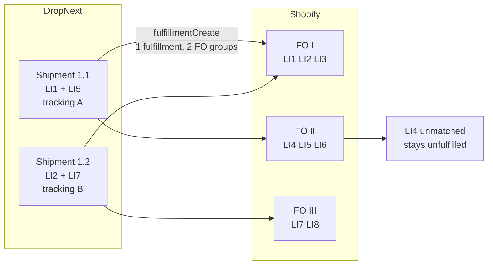
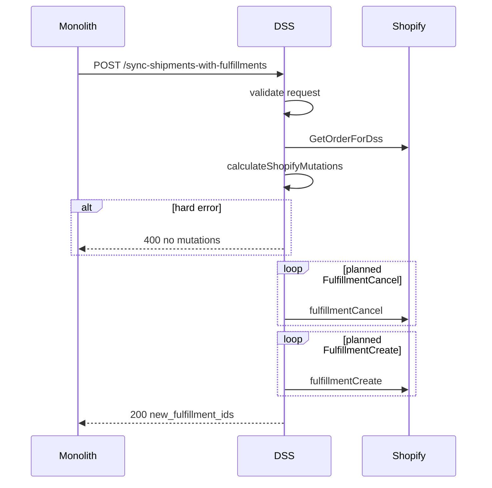

# Spec: Fulfillment order ↔ shipment mapping

Status: approved
Author: Alex (with Claude)
Date: 2026-07-03


## Related specs and docs

| Document | Relationship |
|----------|--------------|
| [`docs/openapi/dss-api.yaml`](../docs/openapi/dss-api.yaml) | **Canonical API contract** for monolith → DSS routes, request/response schemas, and HTTP status codes. |
| [`src/resources/monolith-dss-openapi.json`](../src/resources/monolith-dss-openapi.json) | Machine-readable source Gradle `openApiGenerate` uses to generate Kotlin DTOs — inbound fulfillment schemas must match `dss-api.yaml`. |
| [`docs/FULFILLMENT_VERIFICATION.md`](../docs/FULFILLMENT_VERIFICATION.md) | Manual verification checklist for this flow. |
| [`specs/webhook-deduplication.md`](webhook-deduplication.md) | Separate concern (Shopify → DSS inbound webhooks). Monolith → DSS sync retries are governed by this spec's idempotent cancel-and-recreate design, not webhook dedup. |


## Problem

DropNext **Shipments** and Shopify **Fulfillment Orders (FO)** are independent groupings. A single physical shipment (e.g. Shipment 1.1 with line items 1 and 5) may span multiple FOs (FO I and FO II). Shopify requires fulfillments to respect FO boundaries, so one DropNext shipment becomes **one Shopify fulfillment** whose `lineItemsByFulfillmentOrder` spans multiple FOs — not one fulfillment per FO.



When a supplier adds tracking first and reorganizes splits later, the DSS handles the change by **canceling all existing fulfillments and recreating from the latest payload**. This destructive resync is intentional and idempotent on monolith retry.


## Entity glossary

| Term | Meaning |
|------|---------|
| **Supplier order** | Monolith-side order sent to a supplier for fulfillment. May split into multiple DropNext shipments over time. |
| **Shipment** | A physical package with one tracking number and a set of `(product_variant_id, quantity)` line items. Sent by the monolith in `SyncShipmentsWithFulfillmentsRequest.shipments[]`. |
| **Line item (LI)** | A row on the Shopify order or on a fulfillment order, identified in this flow by `product_variant_id` (Shopify variant `legacyResourceId`). |
| **Fulfillment order (FO)** | Shopify's unit of fulfillment work. An order may have multiple FOs (e.g. different locations). Status must be `OPEN` or `IN_PROGRESS` to accept new fulfillments. |
| **Fulfillment (FI)** | A Shopify fulfillment record with tracking info, created via `fulfillmentCreate`. One FI per DropNext shipment when at least one line matches. |
| **FO line item** | A line on a fulfillment order with `remainingQuantity` (live, already reduced by existing fulfillments) and `totalQuantity` (capacity after those fulfillments are canceled). Matching consumes from `totalQuantity`. Creates use that match; they do not rematch live `remainingQuantity`. |


## API surface

Contract defined in [`docs/openapi/dss-api.yaml`](../docs/openapi/dss-api.yaml) (`POST /sync-shipments-with-fulfillments`, `POST /tracking-update`).

### Monolith → DSS

```
POST {DSS_BASE_URL}/sync-shipments-with-fulfillments
Authorization: Bearer {DSS_API_KEY}
Content-Type: application/json
```

Companion route for carrier status updates (locates fulfillments by `shopify_order_id` + `tracking_number`):

```
POST {DSS_BASE_URL}/tracking-update
```

### Request — `SyncShipmentsWithFulfillmentsRequest`

| Field | Type | Required | Notes |
|-------|------|----------|-------|
| `shopify_subdomain` | string | yes | Short handle or full `*.myshopify.com` host |
| `shopify_order_id` | int64 | yes | Shopify order legacy ID |
| `shipments` | `Shipment[]` | yes | At least one (DSS validation) |

Each **`Shipment`** (per `dss-api.yaml`):

| Field | Type | Required in schema | DSS validation |
|-------|------|------------------|----------------|
| `tracking_number` | string | yes | Non-blank |
| `carrier` | string, nullable | no | Optional; passed to Shopify when present |
| `tracking_url` | string, nullable | no | Optional; passed to Shopify when present |
| `line_items` | `ShipmentLineItem[]` | yes | Non-empty |

Each **`ShipmentLineItem`**:

| Field | Type | Required |
|-------|------|----------|
| `product_variant_id` | int64 | yes |
| `quantity` | integer | yes (> 0) |

Example:

```json
{
  "shopify_subdomain": "acme-downtown",
  "shopify_order_id": 1001,
  "shipments": [{
    "tracking_number": "1Z999AA10123456784",
    "carrier": "UPS",
    "tracking_url": "https://www.ups.com/track?tracknum=1Z999AA10123456784",
    "line_items": [{ "product_variant_id": 101, "quantity": 1 }]
  }]
}
```

### Response — `SyncShipmentsWithFulfillmentsResponse`

| Field | Type | Required | Meaning |
|-------|------|----------|---------|
| `new_fulfillment_ids` | int64[] | yes | Legacy Shopify fulfillment IDs created this run (one per shipment that had matchable lines) |

Example 200 body:

```json
{
  "new_fulfillment_ids": [5001, 5002]
}
```

`new_fulfillment_ids` may be empty when every line in every shipment was skipped — still **200**.

Run summary counts (`canceled`, `created`, `skippedLines`, `skippedShipments`) are logged at `info` only — they are **not** part of the HTTP response contract.

### Error responses

Errors use `ErrorResponse` from `dss-api.yaml` (`{ "error": "..." }`):

| HTTP | When |
|------|------|
| **400** | Request validation, quantity exceeds `totalQuantity`, duplicate `tracking_number`, Shopify user errors |
| **401** | Missing/wrong `Authorization: Bearer`, or no resolvable Shopify Admin token for the shop |
| **404** | Order not found in Shopify |
| **502** | Graphql/network failures mapped to upstream error |

### Implementation entry points

- Handler: [`MonolithWebhookHandlers.handleSyncShipments`](../src/dropnext/dss/handler/MonolithWebhookHandlers.kt)
- Workflow: [`determineShopifyMutations`](../src/dropnext/dss/workflow/determineShopifyMutations.kt) / [`calculateShopifyMutations`](../src/dropnext/dss/workflow/calculateShopifyMutations.kt) / [`effectShopifyMutations`](../src/dropnext/dss/workflow/effectShopifyMutations.kt)
- Matcher: [`FulfillmentOrderMatcher.kt`](../src/dropnext/dss/lib/shopify/graphql/fulfillment/FulfillmentOrderMatcher.kt)
- Validation: [`FulfillmentRequestValidation.kt`](../src/dropnext/dss/lib/shopify/graphql/fulfillment/FulfillmentRequestValidation.kt)
- Log formatting: [`FulfillmentSyncReport.kt`](../src/dropnext/dss/lib/shopify/graphql/fulfillment/FulfillmentSyncReport.kt) (internal stats only)


## Mapping algorithm

### Phase 0 — Request validation (no Shopify calls)

[`SyncShipmentsWithFulfillmentsRequest.validate()`](../src/dropnext/dss/lib/shopify/graphql/fulfillment/FulfillmentRequestValidation.kt) runs before any Graphql call:

- `shopify_order_id` must be positive.
- At least one shipment required.
- Per shipment: non-blank `tracking_number`, non-empty `line_items`.
- Per line item: `quantity > 0`.
- Duplicate `tracking_number` across shipments in one request → **400** (ambiguous lookup for `/tracking-update`).
- `carrier` and `tracking_url` are optional per `dss-api.yaml`; when present they are forwarded to Shopify tracking.

Validation errors accumulate; all are returned in one 400 response.

### Phase 1 — Determine mutations (read-only)

[`determineShopifyMutations`](../src/dropnext/dss/workflow/determineShopifyMutations.kt) loads the order with one `GetOrderForDss` (open fulfillment orders, FO line items with `totalQuantity`, existing fulfillments). No cancel or create calls.

- Exception → **502** (`Network`), no mutations.
- Graphql `errors` and no order → **502** (`GraphqlError`), no mutations.
- `order == null` without errors → **404**, no mutations.

It then calls pure [`calculateShopifyMutations`](../src/dropnext/dss/workflow/calculateShopifyMutations.kt).

### Phase 2 — Calculate mutations (pure)

Matching uses a single in-memory [`FulfillmentQuantityLedger`](../src/dropnext/dss/lib/shopify/graphql/fulfillment/FulfillmentOrderMatcher.kt) seeded from **post-cancel capacity** (`totalQuantity`), not live `remainingQuantity`. There is no second rematch against live remaining quantities.

For each shipment:

1. **Normalize** line items: aggregate duplicate `product_variant_id` rows (sum quantities) via [`normalizeShipmentLineItems`](../src/dropnext/dss/lib/shopify/graphql/fulfillment/FulfillmentOrderMatcher.kt).
2. For each normalized line, match against open FO lines (`OPEN` or `IN_PROGRESS`) whose variant `legacyResourceId` equals the requested `product_variant_id`.
   - Skip FO lines with unparseable variant IDs. Skip when `totalQuantity <= 0`.
   - Select the **best candidate**: the open FO line with the **highest available quantity** from the ledger. Tie-break: first candidate in Graphql response order (strictly greater wins).
   - If no candidate and variant never seen on an open FO → **skip** (`NO_OPEN_FO`).
   - If variant seen but all open FO lines have zero post-cancel capacity (`totalQuantity`) → **skip** (`ZERO_REMAINING`).
   - If requested quantity exceeds available (per line or ledger after prior shipments) → **hard error** (blocks entire sync).
   - If matched → consume quantity from ledger.

Any hard error → **400**, **existing fulfillments untouched** (effect is never called).

Success list, in order:

- one `FulfillmentCancel` per existing non-blank fulfillment id
- one `FulfillmentCreate` per shipment with at least one matched line (`notifyCustomer: false`; tracking from the shipment)

Shipments that match nothing are omitted from the list (not a failure). Skip-line warnings are logged from determine after a successful calculate.

### Phase 3 — Effect mutations (destructive)

[`effectShopifyMutations`](../src/dropnext/dss/workflow/effectShopifyMutations.kt) plays the planned list in order. No rematch. No order reload between creates.

- `FulfillmentCancel`: user errors containing `"already"` (case-insensitive) are no-ops. Any other cancel error → abort; order may be partially canceled (monolith retries the full payload).
- `FulfillmentCreate`: one Shopify create per planned mutation. On success, append the legacy fulfillment id. Stop on the first real error.
- Empty `List<ShopifyError>` means success.

### Phase 4 — Response

Return **200** with `SyncShipmentsWithFulfillmentsResponse`:

- `new_fulfillment_ids` — legacy IDs from successful `fulfillmentCreate` calls (only field in the HTTP body per `dss-api.yaml`)

Log summary at `info` (not returned to monolith):

```
sync-shipments orderId=1001 shop=acme canceled=2 created=3 skippedLines=1 skippedShipments=0 fulfillmentIds=[5001,5002,5003]
```

Per skipped line at `warn`:

```
sync-shipments skipped line shop=acme orderId=1001 tracking=1Z999 variant=999 reason=no_open_fo qty=1
```


## Decision table

| Situation | Action | HTTP |
|-----------|--------|------|
| Shipment line matches open FO with sufficient qty | Include in `fulfillmentCreate` | 200 |
| Shipment line: variant not on any open FO | Skip line, log warning | 200 |
| Shipment line: qty > post-cancel capacity / `totalQuantity` (single line or cross-shipment total) | Fail **before cancel** | 400 |
| Payload fits `totalQuantity` but live `remainingQuantity` is reduced by existing fulfillments | Match passes → cancel → create from that match | 200 |
| Duplicate `tracking_number` in payload | Fail **before cancel** | 400 |
| All lines in a shipment skipped | Skip create for that shipment, log warning | 200 |
| Supplier reorganizes splits | Cancel all → recreate from payload | 200 |
| Shopify order line never in any shipment (e.g. LI 4 in diagram) | Leave unfulfilled | 200 |
| Create fails after N successful creates | Return error; partial state fixed on monolith retry | 4xx/5xx |
| Order not found | No mutations | 404 |
| Cancel fails (non-"already canceled") | Abort | 4xx |
| No Shopify Admin token for shop | No mutations | 401 |


## Defensive rules

### Validate before mutate

**Never cancel existing fulfillments until the full payload is validated against post-cancel capacity.**

```
load order → match ALL shipments against totalQuantity → if ANY hard error → return 400, NO cancels
           → cancel all existing fulfillments
           → create fulfillments from that match (no rematch, no reload)
```

Hard errors that block the entire sync:

- Order not found
- Any shipment line: `quantity > totalQuantity` (post-cancel capacity) on matched FO line
- Duplicate `tracking_number` within the same payload
- Cross-shipment over-allocation detected by the in-memory ledger during matching

Soft outcomes (do **not** block sync):

- Unmatched variant → skip line, log warning, continue

### Fail closed on data integrity; fail open on unmatched lines

| Condition | Behavior |
|-----------|----------|
| Unmatched variant (no open FO) | Skip line, warn, 200 |
| Qty exceeds post-cancel capacity / `totalQuantity` (single line or cross-shipment total) | **400 before cancel** |
| Cancel mutation fails (non-"already canceled") | **Abort**, return error |
| Create fails after some creates succeeded | **Return error**; monolith retries full payload → next sync cancels partial state and recreates |

### Input normalization

Before matching, each shipment is normalized:

- Aggregate duplicate `product_variant_id` rows (sum quantities).
- Reject blank/whitespace-only `tracking_number` (validation layer).
- Reject duplicate `tracking_number` across shipments in one request.

### Null-safe Graphql handling

- All Shopify calls wrapped in `runCatching` → map to `FulfillmentResult.Err.Network`.
- Missing `fulfillmentCreate.fulfillment` after zero userErrors → `UserError("fulfillment missing in response")`.
- Missing `legacyResourceId` → fallback to GID parse; if both fail, log warn and omit from ID list (do not crash).
- Cancel userErrors containing `"already"` filtered as no-op.

### In-memory quantity ledger

[`FulfillmentQuantityLedger`](../src/dropnext/dss/lib/shopify/graphql/fulfillment/FulfillmentOrderMatcher.kt) tracks **post-cancel capacity** (`totalQuantity`) per FO line item GID:

- Initialized from open FOs with `totalQuantity > 0` (not live `remainingQuantity`).
- Matching uses `tryConsume` to catch cross-shipment over-allocation before any Shopify write.
- Creates use the planned line-item ids and quantities; they do not rematch live `remainingQuantity`.


## Split-change and idempotent retry strategy

The cancel-and-recreate pattern is intentionally idempotent:

- Monolith retries the same payload → cancels whatever exists → recreates identical fulfillments.
- Partial failure (2 of 3 shipments created) → retry cancels the 2 partial fulfillments and creates all 3.
- Reorganizing splits (different tracking groupings) → same path; latest payload is source of truth.

**Known operational trade-off:** tracking events attached to canceled fulfillments are lost when fulfillments are canceled. New fulfillments start with a clean event timeline. Downstream `POST /tracking-update` calls (schema `TrackingUpdateRequest`) locate fulfillments by `shopify_order_id` + `tracking_number`, so tracking numbers on the **current** fulfillments must match those in the latest sync payload. Duplicate `tracking_number` values within one sync request are rejected at validation to keep this lookup unambiguous.


## Failure recovery matrix

| Failure point | Order state after failure | Recovery |
|---------------|---------------------------|----------|
| Validation / match error | Unchanged (no cancels) | Fix payload or wait for FO state; retry |
| Cancel error (non-no-op) | Possibly partially canceled | Retry full sync; investigate Shopify error |
| Create error after some creates | Some new fulfillments exist | Retry full sync (cancels partial + recreates all) |
| Network / Graphql error | Depends on phase | Retry; check logs for `shop` and `orderId` |

Monolith should treat any non-2xx as retryable unless the error is a definitive 400 (bad payload). The DSS does not implement its own retry loop; a single attempt per request.


## Observability

All log lines include `shop` (subdomain) and `orderId` (`shopify_order_id`). Never log Admin tokens or raw Graphql bodies.

Skip reasons map to log labels:

| `SkipReason` | Log label |
|--------------|-----------|
| `NO_OPEN_FO` | `no_open_fo` |
| `ZERO_REMAINING` | `zero_remaining` |
| `VARIANT_NOT_FOUND` | `variant_not_found` |


## Known limitations

1. **Pagination** — `GetOrderForDss` fetches `lineItems(first: 100)`, `fulfillmentOrders(first: 50)`, and `fulfillmentOrders.lineItems(first: 100)`. Orders exceeding these limits may have truncated FO data and incorrect matching. Increase pagination in a follow-up if needed.

2. **Variant-only matching** — Lines are matched by `product_variant_id` only. There is no optional `fulfillment_order_id` on `ShipmentLineItem` today. When the same variant appears in multiple open FOs, the matcher picks the FO line with the highest available quantity from the `totalQuantity` ledger.

3. **Tracking events on cancel** — Canceling fulfillments removes their fulfillment events. After a resync, `/tracking-update` must reference tracking numbers on newly created fulfillments.

4. **Per-line skip detail is not in the HTTP response** — only `new_fulfillment_ids` is returned. Skipped line counts and variant IDs appear in DSS logs at `warn`/`info` only.

5. **No partial cancel** — The sync always cancels **all** fulfillments on the order before recreating. There is no incremental "update one shipment only" mode.


## Sequence diagram




## Monolith order ingest (upstream context)

Before sync, the monolith receives order lines from DSS via outbound `POST /orders` (`CreateShopifyOrderRequest` in `dss-api.yaml`). Each `OrderLineItem` includes `product_variant_id` and `fulfillment_order_id`. The sync matcher does **not** use `fulfillment_order_id` from the monolith — it re-resolves open FO lines from live Shopify state by variant ID only.


## Verification checklist

Manual checks (see also [`docs/FULFILLMENT_VERIFICATION.md`](../docs/FULFILLMENT_VERIFICATION.md)):

1. Cross-FO shipment → one fulfillment, correct tracking, both FOs reflected in Shopify Admin.
2. Payload with bad qty → **400**, existing fulfillments untouched.
3. Payload with one unmatched variant → **200**, partial fulfillment created, skip logged.
4. Re-send same payload → idempotent result (cancel + recreate, same outcome).
5. Reorganize splits → new fulfillments match new shipment groupings.

Automated gate:

```powershell
cd dropnext-shopify-service
.\gradlew.bat test
.\gradlew.bat build
```
