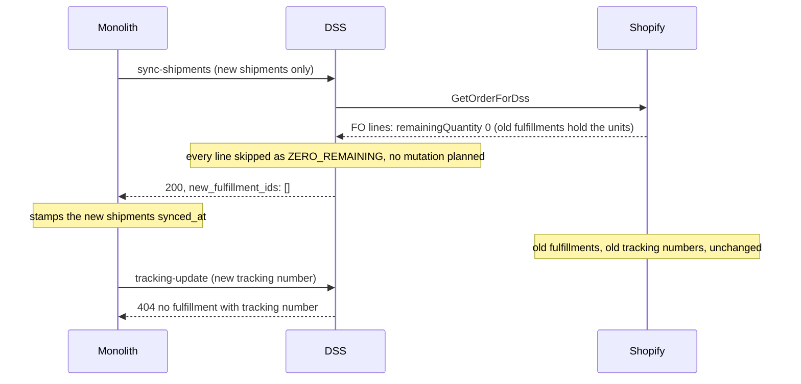

# Why the fulfillment cancel went missing, and what to do about it

Status: analysis, no decision taken yet.
Date: 2026-09-10.
Scope: `POST /sync-shipments-with-fulfillments` in the DSS, the `SyncShipmentsWithFulfillments` job and the
shipment split in the monolith.

## Summary

The DSS used to cancel every fulfillment on a Shopify order and recreate them from the payload it was sent. On
31 August that cancel was removed and the sync became additive. The removal fixed a real bug: the monolith only
ever sends the shipments that are not yet synced, so cancel-all destroyed earlier fulfillments whenever a supplier
added a later shipment. It also broke a real feature: the supplier portal's shipment split, which promises to
replace the current shipments in Shopify and now silently changes nothing there.

Both flows want the same thing: the monolith telling the DSS which tracking numbers it replaced, and the DSS
cancelling only those.

## Timeline

| When | What | Where |
|------|------|-------|
| 2026-07-03 | Spec approved: cancel every fulfillment, recreate from the payload, match against `totalQuantity` (the capacity after the cancels). It assumes the monolith always sends the full set of shipments. | `specs/fulfillment-shipment-fo-mapping.md` |
| 2026-08-31 | Cancel planning removed from `calculateShopifyMutations`; the ledger switched to live `remainingQuantity`. Tests added for "second item later" and "partial failure recovery". Commit message: "Remove unnecessary fulfillment cancellation logic". | commit `d2f24d7` |
| Today | The cancel plumbing is still there and tested, but nothing plans a cancel. The spec and `docs/FULFILLMENT_VERIFICATION.md` still describe cancel-all. | `workflow/effectShopifyMutations.kt`, `src/resources/FulfillmentCancelMutation.graphql` |

## The two flows

### Incremental shipments: why the cancel had to go

The monolith's sync job reads only shipments with `synced_at is null and replaced_at is null`
(`db/sql/job/syncShipmentsWithFulfillmentsRead.kt`). Its own comment: "an already-synced shipment is a Fulfillment
in Shopify and must not be re-sent." Under cancel-all that meant:

1. Day 1: the supplier ships item 1. Payload: shipment A. The DSS creates fulfillment A.
2. Day 8: the supplier ships item 2. Payload: shipment B only. The DSS cancels fulfillment A and creates
   fulfillment B. Item 1 is unfulfilled in Shopify again, and its tracking number is gone.

The spec assumed the opposite: "Monolith retries the same payload, cancels whatever exists, recreates identical
fulfillments." The two designs never matched. The August change picked the monolith's side, and its tests pin
exactly this scenario (`second item later creates without canceling the first fulfillment`).

### Shipment split: what the additive sync broke

The supplier portal's split page says: "Submitting will cancel the current shipment(s) and create new ones."
The split is only offered once the order is synced (`handler/portal/supplier/shipmentSplitHandlers.kt`), so the
old fulfillments always exist in Shopify at that point. `applyShipmentSplit` marks the old shipments replaced,
inserts new ones per tracking number and enqueues the sync. What happens next:

1. The payload carries only the new shipments; the replaced ones are excluded.
2. Their lines point at fulfillment-order lines whose `remainingQuantity` is 0, because the old fulfillments hold
   those units.
3. Every line is skipped as `ZERO_REMAINING`, the shipment is logged as `all_lines_unmatched`, and the DSS answers
   200 with an empty `new_fulfillment_ids`.
4. The monolith stamps the new shipments as synced.
5. Shopify still shows the old fulfillments with the old tracking numbers. The next `/tracking-update` for a new
   tracking number answers 404.

Nothing errors anywhere. A supplier who re-split their shipments believes Shopify was updated.

Related: the DSS creates every fulfillment with `notifyCustomer = false`, so the page's "will likely trigger
shipping-notification emails" is not true through this path either.

## What is still in the code

| Piece | State |
|-------|-------|
| `ShopifyMutation.FulfillmentCancel` | Never constructed. |
| The cancel branch of `effectShopifyMutations` | Dead, still tested by `EffectShopifyMutationsTest`. |
| `ShopifyGraphqlService.cancelFulfillment` and `FulfillmentCancelMutation.graphql` | Unused in production, wire-tested; "already cancelled" is treated as success. |
| `SyncShipmentsRunStats.canceledCount` | Always 0 in the summary log line. |
| The fulfillment spec and the verification doc | Describe cancel-all; checklist items 4 (idempotent retry) and 5 (reorganized splits) no longer hold. |

Keep the plumbing: every option below reuses it.

## Options

| | A. The monolith names what it replaced | B. Reconcile by tracking number | C. Restore cancel-all, monolith sends everything |
|---|---|---|---|
| Contract change | `replaced_tracking_numbers` on the request | The full list of live shipments plus `replaced_tracking_numbers` | The full list of live shipments |
| DSS change | Plan one cancel per named tracking number found on the order's fulfillments, then the creates | Diff against Shopify: create what is missing by tracking number, cancel what was replaced, leave the rest | Plan a cancel for every fulfillment (the removed code) |
| Incremental shipment | Safe | Safe | Safe only because everything is recreated; churns every earlier fulfillment |
| Split | Works | Works | Works |
| Retry after a partial failure | The cancel is a no-op the second time; the create of an already-created shipment is skipped and its id not reported | Clean: what exists is reported as existing | Cancels and recreates the partial state |
| Fulfillments a merchant made by hand in Shopify | Untouched | Untouched | Cancelled |
| Tracking events | Lost on the replaced fulfillments only | Lost on the replaced fulfillments only | Lost on every sync |
| The monolith's `synced_at` | Unchanged | Becomes an optimisation rather than a correctness guard | Must be ignored when building the payload |

## Recommendation

B as the target, A as the first step if the contract change must stay small. In both, the monolith names the
replaced tracking numbers, which it knows (shipments with `replaced_at` set), and the DSS cancels nothing it was
not told about. The spec's validate-before-cancel rule stays: plan every cancel and create against the ledger
first, and touch Shopify only when the whole plan is valid.

Landing order, per the cross-repo rule: the monolith's spec and endpoint first, then the checked-in
`src/resources/monolith-dss-openapi.json` and the DSS planner, in one session. Then rewrite the fulfillment spec
and `docs/FULFILLMENT_VERIFICATION.md` to match.

## Open questions

- Should a cancel Shopify refuses, other than "already cancelled", fail the whole sync so the monolith retries,
  as the original spec had it?
- On a retry after a partial success, should the response carry the ids of fulfillments that already existed for
  the shipments it did not create? B answers yes by construction; A needs a decision.
- Should the split page stop promising customer emails, or should `notify_customer` become a request field?
