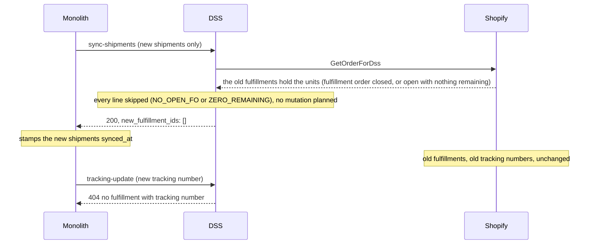

# Why the fulfillment cancel went missing, and what to do about it

Status: decided, see "Decision" below. The numbered specs in this folder carry it out.
Date: 2026-09-10, decision added 2026-09-11, revised 2026-09-11 (what Shopify does on a cancel, what the monolith
already promises).
Scope: `POST /sync-shipments-with-fulfillments` in the DSS, the `SyncShipmentsWithFulfillments` job and the
shipment split in the monolith.

## Decision

The sync reconciles by tracking number: a shipment is a fulfillment with that tracking number, and both sides
name fulfillments by it. Option B below is the target, reached through option A, in four steps that each
leave the system consistent:

| Spec | What it lands | Contract change |
|------|---------------|-----------------|
| `010-skip-shipments-already-fulfilled.md` | A shipment whose tracking number is already on a live fulfillment is skipped, never created twice. Builds on `specs/matcher-cleanup/010-one-walk-per-variant.md`, which makes the plan carry the skips. | None (DSS only). |
| `020-cancel-replaced-fulfillments.md` | The monolith names the tracking numbers it replaced; the DSS checks that the new shipments fit, cancels exactly those fulfillments, reloads the order, then creates. | `replaced_tracking_numbers` on the request. |
| `030-report-per-shipment-outcomes.md` | The response says, per tracking number, what happened, on success and on failure. | Response shape. |
| `040-rewrite-the-fulfillment-docs.md` | The verification doc, `CLAUDE.md` and the monolith's comments describe this design. | None. |

The cancel plumbing (`ShopifyMutation.FulfillmentCancel`, `cancelFulfillment`, `FulfillmentCancelMutation.graphql`)
stays: 020 is its producer. The separate spec that proposed removing it (`specs/remove-fulfillment-cancel/`)
was withdrawn on 2026-09-11 for that reason.

### An observation the options table below got wrong

The retry rows say an already-created shipment "is skipped" on a re-send. That is only true when the
fulfillment-order line has no remaining quantity left, which happens to be the case in the split flow and in
the one test that pins it (`partial failure recovery on retry skips the fulfilled variant and creates the rest`).
With an order of two units of a variant and a shipment of one unit already synced, a re-send of that shipment
matches the remaining unit and creates a *second* fulfillment with the same tracking number. The monolith does
re-send: its job comment says a run whose POST succeeded but whose commit did not sends those shipments again, and
any partial failure in the DSS (the second of two creates failing) makes it retry the whole payload. Nothing in the
current matcher looks at the tracking numbers the order already carries, although `GetOrderForDss` loads them.
Spec 010 closes this before anything else is built on the sync.

### What Shopify does on a cancel

Shopify's documentation of `fulfillmentCancel`:

> Cancels an existing Fulfillment and reverses its effects on associated FulfillmentOrder objects. When you cancel
> a fulfillment, the system creates new fulfillment orders for the cancelled items so they can be fulfilled again.
>
> If a fulfillment order was entirely fulfilled, then it automatically closes. If a fulfillment order is partially
> fulfilled, then the remaining quantities adjust to include the cancelled items. The system creates new
> fulfillment orders at the original Location when items are still stocked there, or at alternative locations
> based on the store's fulfillment priority settings.

The consequence for this folder: the fulfillment-order lines that a create after a cancel has to name may not
exist before the cancel. The DSS cannot plan the creates of a split against the order it loaded before cancelling;
it has to cancel, reload the order, and plan the creates against what Shopify made of it. What can still be checked
before the first mutation is whether the new shipments fit, per variant, into the live remaining quantity plus
what the cancels free. `020` is written that way.

### What the monolith already promises

The monolith's comments already describe the sync as keyed by tracking number. On
`DssWebhookService.syncShipmentsWithFulfillments` (`lib/dss/DssWebhookService.kt`):

> **The DSS must key this on the tracking number and treat a repeat as an update, not a second Fulfillment.**

and on the `SyncShipmentsWithFulfillments` job: "…which the DSS absorbs by keying on the tracking number". The DSS
does not do that today (see the observation above). This folder reaches the end state those comments ask for, by a
different route than "update":

- A repeat of a tracking number (a re-send) is skipped (`010`).
- A tracking number that a split hands to a new shipment, with a different line allocation, is named in
  `replaced_tracking_numbers`, because the split marks its old shipment replaced; the DSS cancels the old
  fulfillment and creates the new one (`020`).
- The monolith's comment names the split as the case in which a tracking number moves to different lines; a
  tracking number belongs to at most one live shipment (`shipments_live_tracking_number_unique_idx`). Whether a
  shipment's lines can change any other way after it was synced is for the monolith spec of `020` to confirm; if
  they can, that change must mark the shipment replaced too.

`040` rewrites those two comments to say this.

## Summary

The DSS used to cancel every fulfillment on a Shopify order and recreate them from the payload it was sent. On
31 August that cancel was removed and the sync became additive. The removal fixed a real bug: the monolith only
ever sends the shipments that are not yet synced, so cancel-all destroyed earlier fulfillments whenever a supplier
added a later shipment. It also broke a real feature: the supplier portal's shipment split, which promises to
replace the current shipments in Shopify and now silently changes nothing there.

Both flows want the same thing: the monolith telling the DSS which tracking numbers it replaced, and the DSS
cancelling only those.

## Timeline

| When | What | Where |
|------|------|-------|
| 2026-07-03 | Spec approved: cancel every fulfillment, recreate from the payload, match against `totalQuantity` (the capacity after the cancels). It assumes the monolith always sends the full set of shipments. | `specs/fulfillment-shipment-fo-mapping.md`, deleted on 2026-09-11; its glossary and boundary diagram now live in `docs/FULFILLMENT_VERIFICATION.md`. |
| 2026-08-31 | Cancel planning removed from `calculateShopifyMutations`; the ledger switched to live `remainingQuantity`. Tests added for a second item shipped later and for partial failure recovery. Commit message: "Remove unnecessary fulfillment cancellation logic". | commit `d2f24d7` |
| 2026-09-10 | The cancel plumbing is still there and tested, but nothing plans a cancel. | `workflow/effectShopifyMutations.kt`, `src/resources/FulfillmentCancelMutation.graphql` |

## The two flows

### Incremental shipments: why the cancel had to go

The monolith's sync job reads only shipments with `synced_at is null and replaced_at is null`
(`db/sql/job/syncShipmentsWithFulfillmentsRead.kt`). Its own comment: "an already-synced shipment is a Fulfillment
in Shopify and must not be re-sent." Under cancel-all that meant:

1. Day 1: the supplier ships item 1. Payload: shipment A. The DSS creates fulfillment A.
2. Day 8: the supplier ships item 2. Payload: shipment B only. The DSS cancels fulfillment A and creates
   fulfillment B. Item 1 is unfulfilled in Shopify again, and its tracking number is gone.

The spec assumed the opposite: "Monolith retries the same payload, cancels whatever exists, recreates identical
fulfillments." The two designs never matched. The August change picked the monolith's side, and its tests pin
exactly this scenario (`a second item shipped later creates without canceling the first fulfillment`).

### Shipment split: what the additive sync broke

The supplier portal's split page says: "Submitting will cancel the current shipment(s) and create new ones."
The split is only offered once the order is synced (`handler/portal/supplier/shipmentSplitHandlers.kt`), so the
old fulfillments always exist in Shopify at that point. `applyShipmentSplit` marks the old shipments replaced,
inserts new ones per tracking number and enqueues the sync. What happens next:

1. The payload carries only the new shipments; the replaced ones are excluded.
2. Their lines point at units the old fulfillments hold. When the old fulfillments completed a fulfillment order,
   Shopify closed it; otherwise its lines are open with `remainingQuantity` 0.
3. Every line is skipped, as `NO_OPEN_FO` for a closed fulfillment order and as `ZERO_REMAINING` for an open one
   with nothing remaining; the shipment is logged as `all_lines_unmatched`, and the DSS answers 200 with an empty
   `new_fulfillment_ids`.
4. The monolith stamps the new shipments as synced.
5. Shopify still shows the old fulfillments with the old tracking numbers. The next `/tracking-update` for a new
   tracking number answers 404.

Nothing errors anywhere. A supplier who re-split their shipments believes Shopify was updated.

Related: the DSS creates every fulfillment with `notifyCustomer = false`, so the page's "will likely trigger
shipping-notification emails" is not true through this path either.

## What is still in the code

| Piece | State |
|-------|-------|
| `ShopifyMutation.FulfillmentCancel` | Never constructed. |
| The cancel branch of `effectShopifyMutations` | Dead, still tested by `EffectShopifyMutationsTest`. |
| `ShopifyGraphqlService.cancelFulfillment` and `FulfillmentCancelMutation.graphql` | Unused in production, wire-tested; "already cancelled" is treated as success. |
| The `canceled=` count of the `sync-shipments` summary line | Always 0. |
| `docs/FULFILLMENT_VERIFICATION.md` | Describes the additive sync as it runs since 2026-08-31, with the gaps this folder closes listed as known gaps. |

Keep the plumbing: every option below reuses it.

## Options

| | A. The monolith names what it replaced | B. Reconcile by tracking number | C. Restore cancel-all, monolith sends everything |
|---|---|---|---|
| Contract change | `replaced_tracking_numbers` on the request | The full list of live shipments plus `replaced_tracking_numbers` | The full list of live shipments |
| DSS change | Plan one cancel per named tracking number found on the order's fulfillments; after the cancels, reload the order and plan the creates | Diff against Shopify: create what is missing by tracking number, cancel what was replaced, leave the rest | Plan a cancel for every fulfillment (the removed code) |
| Incremental shipment | Safe | Safe | Safe only because everything is recreated; churns every earlier fulfillment |
| Split | Works | Works | Works |
| Retry after a partial failure | The cancel is a no-op the second time; the create of an already-created shipment is skipped and its id not reported | Clean: what exists is reported as existing | Cancels and recreates the partial state |
| Fulfillments a merchant made by hand in Shopify | Untouched | Untouched | Cancelled |
| Tracking events | Lost on the replaced fulfillments only | Lost on the replaced fulfillments only | Lost on every sync |
| The monolith's `synced_at` | Unchanged | Becomes an optimisation rather than a correctness guard | Must be ignored when building the payload |

## Recommendation

B as the target, A as the first step if the contract change must stay small. In both, the monolith names the
replaced tracking numbers, which it knows (shipments with `replaced_at` set), and the DSS cancels nothing it was
not told about. The July spec's validate-before-cancel rule stays, in the form Shopify allows: before the first
cancel, check per variant that the new shipments fit into the live remaining quantity plus what the cancels free;
plan the creates against the order reloaded after the cancels (see "What Shopify does on a cancel").

Landing order, per the cross-repo rule: a monolith spec, then the monolith's payload and job, then the checked-in
`src/resources/monolith-dss-openapi.json` and the DSS planner, in one session. Then `040` rewrites
`docs/FULFILLMENT_VERIFICATION.md` and the monolith's comments to match.

## Open questions

Each is carried into the spec that decides it.

- Should a cancel Shopify refuses, other than "already cancelled", fail the whole sync so the monolith retries,
  as the original spec had it? `020` answers a `400` and keeps "create anyway" as its open question 2.
- On a retry after a partial success, should the response carry the ids of fulfillments that already existed for
  the shipments it did not create? `030` answers yes: `already_fulfilled` with the id.
- Should the split page stop promising customer e-mails, or should `notify_customer` become a request field?
  `020`, open question 3.

## Sources

- [Shopify Graphql Admin API: `fulfillmentCancel`](https://shopify.dev/docs/api/admin-graphql/latest/mutations/fulfillmentCancel):
  the quoted description of what a cancel does to fulfillment orders.
